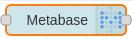
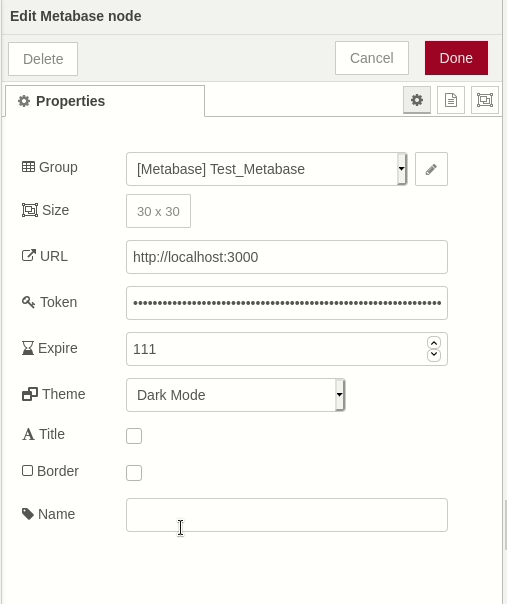
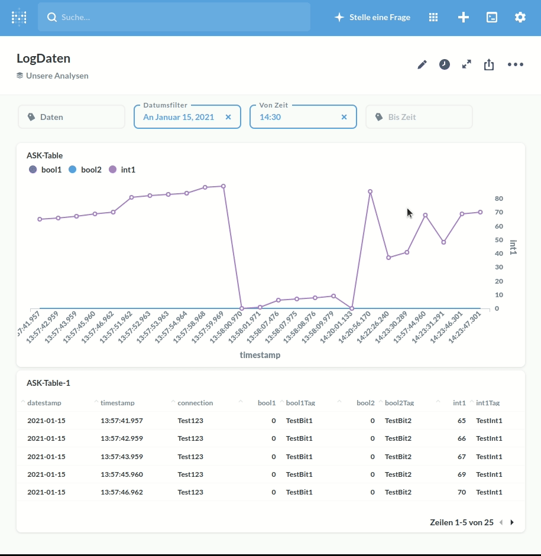

# node-red-contrib-ui-metabase

A simple node to embed Metabase Dashboards and Queries for the Node-RED Dashboard



These nodes uses jsonwebtoken.

## install

To install the node run the following from your Node-RED user directory (`~/.node-red`):

```bash
npm install node-red-contrib-ui-metabase
```

or

Or install the node from the Palette section of your Node-RED editor by searching by name (`node-red-contrib-ui-metabase`).

## configuration



- `Name`    === `Node Name` - Default **Metabase**
- `URL`     === `Web address of Metabase Server` - Default **http://localhost:3000**
- `Token`   === `Token created by Metabase`
- `Expire`  === `Minuites before link expires` - Default **100**
- `Theme`   === `Theme mode` - Default **Light mode**
- `Title `  === `Show title` - Default **false**
- `Border ` === `Show border` - Default **false**

## Setup Metabase for embedded applications
- See online documention from metabase
- https://www.metabase.com/docs/latest/administration-guide/13-embedding.html#embedding-metabase-in-other-applications

## Usage




## Exsample flow 


